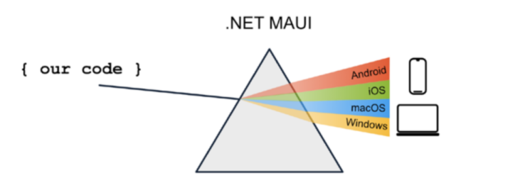
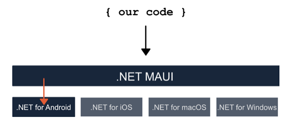
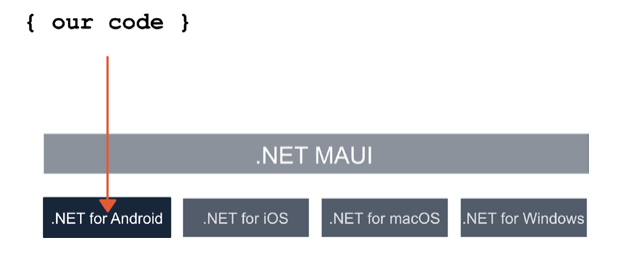

# Введение в MAUI

Эта книга предназначена для разработчиков, которые плохо знакомы с .NET MAUI и кроссплатформенными приложениями.
разработка. Вы должны иметь базовые знания C#, но не требуете предварительного
знание использования .NET MAUI. Содержание варьируется от начального до
к более продвинутым темам и, следовательно, предназначен для удовлетворения широкого круга читателей.
Эта книга дает подробное объяснение каждой ключевой концепции в
.NET MAUI, и вы будете использовать эти концепции в практических примерах, в процессе создания кроссплатформенного приложения. 

# ГЛАВА 1

# Введение в .NET MAUI

В этой главе вы получите представление о .NET
MAUI, чем он отличается от других фреймворков и что он предлагает вам в качестве разработчик, желающий создать кроссплатформенное приложение, которое может работать на
как в мобильной, так и в настольной среде. Я также расскажу о причинах, по которым вы должны рассмотреть его для вашего следующего проекта, взвесив возможности
и ограничения фреймворка, а также богатый набор инструментов
параметры.

# Что такое .NET MAUI?

**.NET Multi-platform App UI**, или сокращенно .NET MAUI, — это кроссплатформенная платформа, которая позволяет разработчикам создавать мобильные и настольные приложения.
приложения, написанные на C# и XAML. Это позволяет разработчикам ориентироваться на оба мобильные (Android и iOS) и настольные (macOS и Windows) платформы из единой кодовой базы. Рисунок 1-1 показывает официально поддерживаемые платформы.
от .NET MAUI и Microsoft.



Рисунок 1-1. Поддержка платформы .NET MAUI

NET MAUI предоставляет единый API, который позволяет разработчикам писать один раз и бежать куда угодно. При создании приложения .NET MAUI вы пишете код, взаимодействующий с этим единым межплатформенным API и .NET MAUI обеспечивает мост между вашим кодом и уровнем, зависящим от платформы.

Если вы заглянете внутрь призмы на рис. 1-1, то сможете начать
понимать компоненты, которые использует и предлагает .NET MAUI.

На рис. 1-2 показано, как компилируется приложение для Android.



Рисунок 1-2. Взаимодействие с API-интерфейсами .NET MAUI

Конечно, будут случаи, когда вам потребуется прямой доступ к
особенность платформы. .NET MAUI также обеспечивает достаточную гибкость, чтобы вы могли
достичь этого, взаимодействуя непосредственно с API-интерфейсами платформы:

- .NET для Android
- .NET для iOS
- .NET для macOS
- Библиотека пользовательского интерфейса Windows (WinUI) 3

На рис. 1-3 показано, как код обходит API-интерфейсы .NET MAUI и
напрямую взаимодействует с API .NET для Android.


Рисунок 1-3. Взаимодействие с API для конкретных платформ

# Копаем немного глубже

Есть некоторые дополнительные шаги, которые инструменты будут выполнять под капотом чтобы ваше приложение было построено и в конечном итоге готово к использованию на каждом из возможные платформы.

При создании приложения .NET, даже если оно не использует .NET MAUI, вы, скорее всего, услышите термин BCL, который является сокращением от базового класса библиотеки. Это основа всех приложений .NET, и точно так же что ```.NET MAUI``` абстрагируется от платформ, для которых вы хотите создавать, BCL
абстрагируется от того, что эта платформа реализует при запуске вашего приложения.

Чтобы запустить ваше приложение на желаемой платформе, вам понадобится .NET. время выполнения. Для Android, iOS и macOS это среда выполнения Mono. 

Среда выполнения Mono позволяет запускать код .NET на множестве различных платформы. Для Windows это Win32. Каждая из этих сред выполнения обеспечивает функциональность, необходимая для BCL, и, следовательно, согласованная работа в среде на всех поддерживаемых платформах.

Мне нравится думать о ```BCL``` как о договоре между тем, что мы
компиляции и с чем мы запускаем этот скомпилированный код.
На рис. 1-4 показаны все уровни, участвующие в компиляции и запуске приложения .NET MAUI.


Рисунок 1-4. Полная разбивка

Чтобы продолжить пример сборки для Android предыдущей
диаграммы и принимая во внимание диаграмму на рис. 1-4, можно сделать следующее.

Сказать: Ваш код скомпилирован для .NET MAUI, .NET для Андроид и
библиотека базовых классов. Затем он запускается в среде выполнения ```Mono```, которая обеспечивает полнyю реализацию библиотеки базовых классов на платформе Android.
Глядя на приведенное выше заявление, вы можете заменить детали, которые зависит от платформы с другой платформой (например, замена Android на iOS) и утверждение все равно будет верным.

# Откуда NET MAUI?

```NET MAUI``` — это эволюция Xamarin.Forms, которая сама по себе имеет богатый история предоставления разработчикам отличного способа создания кроссплатформенных
Приложения. Конечно, идеальных фреймворков не бывает, и Xamarin.Forms безусловно, имел свои ограничения. К счастью, команда Microsoft решила принять прагматичный подход, сделать шаг назад и оценить все болевые точки, которые существовали для них как сопровождающих и (больше важно) для нас как разработчиков, использующих фреймворк.
Таким образом, мы не только получаем улучшения от Xamarin
Framework как часть этой эволюции, но мы также получаем все преимущества, которые
поставляются с .NET, такими как мощное встроенное внедрение зависимостей, лучшую
производительность и другие темы, которые я буду затрагивать в этой книге.

Это заставляет меня поверить, что эта зрелая кросс-платформенная структура наконец может стать первоклассным гражданином экосистем .NET и Microsoft. я
думаю, подсказка находится в первой части его нового имени.
Судя по названию, .NET MAUI подразумевает, что это инфраструктура пользовательского интерфейса, и хотя это правда, это не все, что может предложить фреймворк.
Через API платформы .NET и .NET MAUI нам предоставляется
способы выполнения общих прикладных задач, таких как доступ к файлам, доступ к мультимедиа из галереи устройства, используя акселерометр и многое другое. 

API-интерфейсы платформы .NET MAUI ранее были известны как Xamarin Essentials, поэтому, если у вас есть опыт работы с Xamarin Forms, они должно быть знакомо. Я коснусь гораздо большего количества этой функциональности, когда вы продвигаться по этой книге

# Чем .NET MAUI отличается от конкурентов

.NET MAUI предоставляет свои собственные элементы управления (например, кнопку), а затем
сопоставляет их с соответствующей реализацией на каждой платформе. Продолжать на примере кнопки это ```UIButton``` от UIKit на iOS и
macOS, ```AppCompatButton``` из AndroidX.AppCompat.Widget на
Android и ```Button``` из Microsoft.UI.Xaml.Controls в Windows.
Это дает отличный уровень охвата с точки зрения обеспечения общего реализация, которая работает на всех платформах. С введением архитектуру обработчика .NET MAUI, мы действительно получаем возможность настроить даже самую маленькую из
детали реализации для каждой платформы. Это особенно полезно
когда общий API, предоставляемый .NET MAUI, может быть ограничен до наименьшее количество пересечений между каждой платформой и не обеспечивает все, что нам нужно. Стоит отметить, что ваше приложение будет отображать по-разному на каждой платформе, поскольку он использует специфичные для платформы элементы управления и поэтому их внешний вид.

# Зачем использовать .NET MAUI?

Есть несколько причин, по которым вам следует рассмотреть возможность использования .NET MAUI для
ваше следующее приложение: большое количество поддерживаемых платформ, увеличение возможности совместного использования кода, акцент на предоставлении разработчикам возможности создавать приложения, соответствующие их стилю, отличная производительность и многое другое. Давайте взгляните на них.

# Поддерживаемые платформы

.NET MAUI официально поддерживает все следующие платформы:

- Android 5.0 (уровень API 21) и выше
- iOS 11.0 и выше
- macOS 10.15 и выше (с Mac Catalyst) **
- Рабочий стол Windows

**Замечание**: MacCatalyst позволяет создавать нативные приложения для Mac и обмениваться кодом с
приложения для iPad. Это технология Apple, которая позволяет разработчикам совместно использовать код.
между Mac и iPad. Для получения дополнительной информации перейдите к документации Apple.
на https://developer.apple.com/mac-catalyst/.

.NET MAUI обеспечивает поддержку сообщества для
- Tizen: реализация предоставлена Samsung

Я настоятельно рекомендую ознакомиться с документированным списком поддерживаемых платформы в случае, если он изменился с момента написания. Список можно найти
на странице


https://learn.microsoft.com/dotnet/maui/supported-platforms.

# Совместное использование кода

Фундаментальная цель всех кроссплатформенных фреймворков состоит в том, чтобы разработчикам сосредоточиться на достижении своих основных целей, сократив усилия требуется для поддержки нескольких платформ. Это достигается путем обмена
общий код на всех платформах. Где я считаю, что .NET MAUI превосходит альтернативные фреймворки — в первых четырех символах имени; Майкрософт прилагает все усилия, чтобы создать единую .NET, которая может работать где угодно.
Поскольку я сам являюсь полноценным разработчиком, мне, как правило, также приходится работать над веб-интерфейсом.

Как мобильные приложения, .NET позволяет мне писать
код, который можно скомпилировать в единую библиотеку. Затем эту библиотеку можно распределяется между веб-приложениями и клиентскими приложениями, что еще больше увеличивает возможности совместного использования кода и, в конечном итоге, сокращение усилий по обслуживанию.

Я выступал с докладами на основе мобильной игры (www.superwordsearch.com) я построил с помощью Xamarin.Forms, где я хвастался, что мы смогли написать 96 % нашего кода в нашем общем проекте. я еще не конвертировал это через .NET MAUI; однако первоначальные исследования показывают, что это число
будет только увеличиваться.

Существуют дополнительные возможности для совместного использования кода между сетью и клиентом, таких как использование .NET MAUI Blazor, который обеспечивает использование технологии внутри приложения .NET MAUI. Пока не буду освещать .NET MAUI Blazor подробно описан в этой книге, Microsoft предоставляет некоторые действительно отличная документация и руководства о том, что это такое и как создать свой первое приложение с этой технологией на https://learn.microsoft.com/aspnet/core/blazor/hybrid/tutorials/maui.

# Свобода разработчиков

.NET MAUI предлагает множество способов создания одного и того же. Где Xamarin.Forms был в значительной степени разработан для поддержки конкретной архитектуры приложений.
(например, MVVM, о котором я расскажу в главе 4), .NET MAUI — это
другой. Одним из ключевых преимуществ перезаписи командой Microsoft является то, что теперь позволяет использовать другие архитектуры, такие как MVU (глава 4). Это позволяет нам как разработчикам для создания приложений, которые соответствуют нашим предпочтениям, от разные архитектурные стили, разные способы создания пользовательского интерфейса и даже различные способы оформления приложения.

# Сообщество

У Xamarin всегда было прекрасное сообщество. От блоггеров до специалистов по сопровождению открытого исходного кода существует огромное количество информации и полезной информации.
пакеты, которые помогут любому разработчику создать отличное мобильное приложение.
Что меня действительно поразило, так это количество сотрудников Microsoft.
кто является частью этого сообщества; они явно увлечены
технологии и посвящают свое свободное время тому, чтобы способствовать этому сообщество. Эволюция .NET MAUI приносит с собой это сообщество

# Быстрый цикл разработки

.NET MAUI предлагает два отличных способа повысить производительность труда разработчика.

## Горячая перезагрузка .NET

.NET Hot Reload позволяет изменять управляемый исходный код во время приложение работает, без необходимости вручную приостанавливать или нажимать точка останова. Затем ваши изменения кода могут быть применены к вашему запущенному приложению без необходимости перекомпилировать. Стоит отметить, что эта функция не характерен для .NET MAUI, но является еще одним прекрасным примером всех достоинств это связано с тем, что фреймворк является частью экосистемы .NET.

## Горячая перезагрузка XAML

Горячая перезагрузка XAML позволяет редактировать пользовательский интерфейс в файлах XAML, сохранять изменения и наблюдайте за этими изменениями в работающем приложении без необходимость перекомпилировать. Это фантастическая функция, которая действительно сияет, когда
вам нужно настроить некоторые элементы управления.

# Производительность

NET MAUI приложения скомпилированы в собственные пакеты для каждого из поддерживаемых платформ, а это означает, что они могут быть построены так, чтобы работать хорошо.
Android всегда был самой медленной платформой при работе с Xamarin.Forms и команда Microsoft усердно работали и демонстрируя улучшения. Команда предоставила действительно отличные
ресурсов в виде сообщений в блогах, освещающих достигнутый прогресс.
сделано для того, чтобы время запуска приложений Android было значительно ниже одна секунда. Эти сообщения охватывают метрики, а также советы о том, как сделать приложения реально летающими.

- • https://devblogs.microsoft.com/dotnet/
улучшения производительности в dotnet-maui/
-• https://devblogs.microsoft.com/dotnet/dotnet-7-
улучшения производительности в dotnet-maui/

Приложения для Android, созданные с использованием .NET MAUI, компилируются из C# в
промежуточный язык (IL), который затем точно в срок (JIT) компилируется в
нативная сборка при запуске приложения.

Приложения для iOS и macOS, созданные с использованием .NET MAUI, полностью опережают время
(AOT), скомпилированный из C# в собственный ассемблерный код ARM.
Приложения для Windows, созданные с помощью .NET MAUI, используют библиотеку пользовательского интерфейса Windows (WinUI) 3 для создания собственных приложений, предназначенных для рабочего стола Windows.

# Сильные коммерческие предложения

Существует несколько коммерческих вариантов, предоставляющих дополнительные элементы пользовательского интерфейса и другие интеграции, такие как редактирование документов Office или просмотр PDF в ваши приложения .NET MAUI. Некоторые варианты (на момент написания)

- syncfusion

«Многофункциональные/гибкие/быстрые элементы управления .NET MAUI для
создание кроссплатформенных мобильных и настольных приложений с помощью C# и XAML»

www.syncfusion.com/maui-controls


- Пользовательский интерфейс Telerik для .NET MAUI

«Начните разработку многоплатформенных приложений с предварительной версией пользовательского интерфейса Telerik для элементов управления .NET MAUI!»

www.telerik.com/maui-ui

- devexpress

«Наша библиотека компонентов пользовательского интерфейса мультиплатформенного приложения .NET
поставляется с высокопроизводительными компонентами пользовательского интерфейса для Android
и разработка для мобильных устройств iOS (поддержка WinUI для настольных ПК
выйдет в 2022 году). Библиотека включает в себя сетку данных, диаграмму, планировщик, редакторы данных, CollectionView, вкладки и ящик компонент тс.”

www.devexpress.com/maui/

Обратите внимание, что хотя это коммерческие продукты, некоторые из них предоставлять бесплатные лицензии для небольших компаний или независимых разработчиков.

# Ограничения .NET MAUI

Я надеюсь, что это не доставит мне слишком много неприятностей с замечательной командой
в Майкрософт ☺. Этот раздел не предназначен для описания технологии (я
не стала бы писать книгу о том, во что не верю); это чисто
направлена на то, чтобы прояснить, чего нельзя достичь или, по крайней мере, что не
предоставляется из коробки, чтобы помочь вам, как читателю, лучше всего решить, является ли это
подходящую технологию для вашего следующего проекта. Я, конечно, на это надеюсь, но давайте
посмотрите на то, что я чувствую, его основные ограничения.

# Нет поддержки Web Assembly (WASM)

NET MAUI не поддерживает нацеливание на веб-сборку. Этот
означает, что вы не можете ориентироваться в Интернете непосредственно из проекта .NET MAUI,
но вы по-прежнему можете запускать ```Blazor``` внутри своего приложения .NET MAUI. Это открывает дверь для дальнейшего совместного использования кода; как обсуждалось ранее, вполне возможно для создания компонентов Blazor, которые могут совместно использоваться .NET MAUI Blazor и приложения .NET Blazor. Если вам требуется прямая поддержка WASM, то хорошая альтернатива .NET MAUI — это платформа ```Uno```.

# Нет API камеры

Это было болевой точкой для многих разработчиков на протяжении всей жизни Xamarin.Forms и продолжает оставаться основной проблемой для .NET MAUI. Есть несколько веских аргументов, почему этого не произошло.

Создание API камеры для Android Camera не было легкой задачей, как я уверен, большинство разработчиков, которые взялись за это путешествие может свидетельствовать. Тот факт, что Google переписывает весь API в третий раз показывает неотъемлемые проблемы.

# Приложения не будут выглядеть одинаково на каждой платформе

Элементы управления в .NET MAUI используют реализации платформы, поэтому элемент управления вводом на iOS будет отображаться иначе, чем на Android. Есть исследования, чтобы найти способ избежать этого и иметь элементы управления отображаются одинаково на всех платформах, но это все еще ранняя стадия.

# Отсутствие воспроизведения мультимедиа из коробки

Воспроизведение мультимедиа стало очень распространенной задачей. Так много приложений в наши дни предлагают возможность воспроизведения видео или аудио. Я подозреваю, что это также связано с огромным различия между платформами в том, как они обеспечивают поддержку воспроизведения.
Хотя эта функциональность официально не предоставляется .NET MAUI, это
не означает, что функциональность невозможна.

# Хотя стакан наполовину полон

Я считаю, что ограничения — это не плохо. Делать некоторые вещи хорошо гораздо лучшее достижение, чем делать все плохо! Я ожидаю список ограничения будут уменьшаться по мере развития .NET MAUI. Благодаря тому, что .NET MAUI имеет открытый исходный код, и мы, как потребители, можем предложить улучшения и даже предоставить их непосредственно для дальнейшего улучшения этого рамки. Я также должен добавить, что набор инструментов сообщества .NET MAUI
здорово (конечно, я предвзят, потому что в настоящее время помогаю поддерживать его). Это
представляет ценность для сообщества .NET MAUI, а также поддерживается это сообщество. Еще одним огромным преимуществом является то, что концепции в этом инструментарии может и был повышен до самого .NET MAUI. Это дает мне надежду, что однажды появится хороший выбор как для камеры, так и для воспроизведения мультимедиа API в .NET MAUI.

# Как создавать приложения .NET MAUI

Существует несколько различных способов создания приложения с помощью .NET MAUI. я
рассмотрим каждый по очереди, раскрывая некоторые детали, которые, надеюсь, помогут вам
решить, что лучше всего подходит для вас.

# Visual Studio

Visual Studio доступна как для Windows, так и для macOS, но хотя эти
обе операционные системы официально поддерживаются, стоит отметить, что
Продукты Visual Studio являются отдельными и сами по себе не кроссплатформенными.
Это означает, что функциональность и уровни поддержки различаются между ними.
Обратите внимание, что версии для Windows и macOS поставляются с тремя различными
вариантов ценообразования, но я хотел бы обратить ваше внимание на ```Community Edition```, бесплатное для использования небольшими группами и в образовательных целях.
На самом деле, всего в этой книге можно достичь с помощью бесплатного сообщества.
версия.

# Visual Studio (Windows)

Visual Studio — это комплексная интегрированная среда разработки или IDE, которая обеспечивает отличный опыт разработки. я использовал это инструмент в течение многих лет, и я могу с радостью сказать, что он продолжает улучшаться с каждым новая версия.

Для создания приложений .NET MAUI необходимо использовать как минимум Visual Studio 2022.
В Visual Studio (Windows) можно создавать приложения эта цель

- Андроид
- iOS *
- Окна

**Примечание**: Для iOS требуется сетевой Mac с Xcode 13.0 или выше. Это связано с ограничениями, установленными Apple.

# Visual Studio для Mac

Visual Studio для Mac была выпущена совсем недавно, и по состоянию на 2022 г.
претерпел значительную переработку, чтобы обеспечить лучший опыт для разработчиков.
Для создания приложений .NET MAUI необходимо использовать как минимум Visual Studio 2022.
для Mac.