# Глава 2. Создание нашего первого приложения

В этой главе вы узнаете, как настроить процесс разработки в среде на всех необходимых платформах. Затем вы будете использовать среду для создания, сборки и запуска вашего самого первого .NET MAUI приложение. Наконец, вы взглянете на приложение, которое вы создадите в процессе чтения этой книге.

## Настройка среды

Прежде чем вы приступите к созданию и сборке приложения, вы должны настроить среду.

## macOS

Есть несколько инструментов, которые вы должны установить в macOS, чтобы обеспечить поддержку создание приложений ```Mac Catalyst``` и предоставление возможности сборки iOS приложения из среды Windows.

**Примечание**. Это необходимо, если вы хотите разрабатывать на macOS или развертывать на Mac или устройство iOS (даже с компьютера Windows). Если вы довольны только развертыванием в Windows или Android с компьютера Windows, вы можете пропустить эту часть или просто прочитать ее для ознакомления.

## Visual Studio для Mac

Как упоминалось в предыдущей главе, вы в первую очередь сосредоточитесь на
с помощью Visual Studio в Windows. У вас будет требование использовать Visual
Studio для Mac намного позже, но вы настроите ее сейчас. Также обратите внимание, что пока книга фокусируется на использовании Visual Studio в Windows, довольно много концепции должны быть достаточно хорошо переведены в Visual Studio для Mac, если это ваша предпочтительная среда.

Загрузите и установите Visual Studio 2022 для Mac. Это может быть доступно
с https://visualstudio.microsoft.com/vs/mac/.

1. Откройте скачанный файл ```VisualStudioForMacInstaller.dmg```.
2. Дважды щелкните «Установить Visual Studio для Mac» вариант. Рисунок 2-1 показывает установщик Visual Studio для Mac.

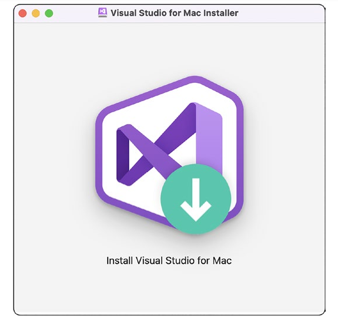

Рисунок 2-1. Установщик Visual Studio для Mac

3. Скорее всего, вам будет показано диалоговое окно безопасности.
уверен, что вы хотите запустить этот установщик. Двойная проверка
,детали, а затем продолжить, если все выглядит хорошо.

4. Примите условия, нажав "Продолжать".

5. В следующем окне выберите ```.NET```, ```Android```, ```iOS``` и
```macOS (Cocoa)```, а затем нажмите «Установить». Рисунок 2-2 показывает установщик с необходимыми опциями для ```.NET MAUI``` проверил.

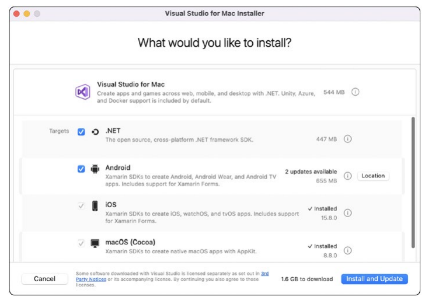

Рисунок 2-2. Варианты установки Visual Studio для Mac

Пожалуйста, обратитесь к странице документации Microsoft по адресу

https://learn.microsoft.com/dotnet/maui/get-started/installation?tabs=vsmac, 
 
если изменились какие-либо параметры установки.

## X-code

```Xcode``` — это интегрированная среда разработки Apple для создания приложений для iOS и macOS. Вам не нужно использовать Xcode напрямую, но он нужен Visual Studio, чтобы скомпилируйте свои приложения для iOS и macOS.
К счастью, эта установка проста, несмотря на то, что она довольно большая.
скачать.

1. Откройте приложение App Store.

2. Введите Xcode в поле поиска и нажмите клавишу возврата.

3. Щелкните Получить. Рисунок 2-3 показывает Xcode, доступный на AppStore Apple.


Рисунок 2-3. Xcode в App Store

4. После загрузки откройте Xcode и подождите, пока он установить инструменты командной строки. Обратите внимание, что это обычно требуется выполнять после каждого основного обновление до Xcode тоже.

**Замечание**. Я предлагаю соблюдать осторожность при применении обновлений ко всему набору приложений, которые вы устанавливаете сегодня. Как правило, при появлении нового выходит большой релиз .NET MAUI, он, скорее всего, требует обновления Xcode. Мне лично нравится синхронизировать эти ожидаемые версии, поэтому я рекомендуется сначала проверить наличие обновлений в Visual Studio, а затем проверка того, что он ожидает новую версию Xcode, прежде чем переходить к обновить это.

## Удаленный доступ

Последним шагом в настройке среды macOS является включение удаленного входа в систему, чтобы Visual Studio (Windows) могла связываться с Mac для создания и
запускать приложения iOS и macOS.

1. Откройте "Системные настройки" (macOS Ventura 13.0+) или "Системные настройки" в старых версиях macOS.

2. Выберите Общие на левой панели, а затем "Совместное использование", как показано на рис. 2-4. Это изображения/изображение показывает диалоговое окно системных настроек macOS с Пункт меню общего доступа выделен.


Рисунок 2-4. системные настройки macOS

3. Включите удаленный вход. На рис. 2-5 показан удаленный Опция входа включена.

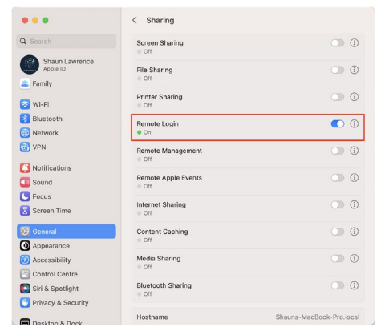

Рисунок 2-5. параметры обмена macOS

4. Добавьте своего пользователя в список разрешенных пользователей для "Удаленный вход". Мой пользователь является администратором, поэтому группа пользователей «Администраторы» разрешает удаленный вход в систему доступ для этого пользователя. На рис. 2-6 показан удаленный Редактор входа в систему, чтобы разрешить доступ пользователям macOS.

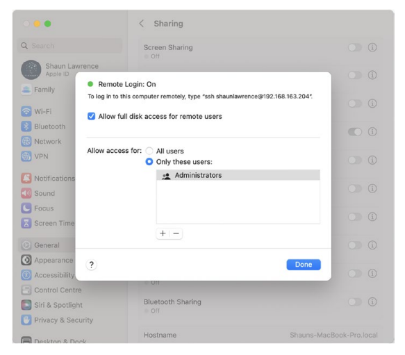

Рисунок 2-6. Параметры удаленного входа в macOS

5. Вот и все! Теперь ваш mac должен быть готов к использованию.

# Windows

## Visual Studio

Во-первых, вы должны установить Visual Studio 2022. Эти шаги помогут вам
путем подготовки его к созданию приложений .NET MAUI:

1. Загрузите и установите Visual Studio 2022. Это
можно получить с https://visualstudio.microsoft.com/downloads/.
2. Запустите установщик и увидите загруженность экран выбора. Выберите "Мобильная разработка" с рабочей нагрузкой .NET. На рис. 2-7 показан визуальный Установщик Studio Windows с необходимым .NET
Массачусетс Рабочие нагрузки пользовательского интерфейса проверены.


Рисунок 2-7. Варианты установки Visual Studio для Windows

Пожалуйста, обратитесь к странице документации Microsoft по адресу https://learn.microsoft.com/dotnet/maui/get-started/installation?tabs=vswin, если
изменились какие-либо параметры установки.

## Visual Studio для macOS

Последним элементом настройки в среде Windows является настройка
соединение между Visual Studio и macOS, чтобы iOS и macOS сборки могут быть скомпилированы.

1. В Visual Studio выберите пункт меню Инструменты.
2. Выберите iOS ➤ Сопряжение с Mac.
3. Проверьте и подтвердите доступ к брандмауэру. Рисунок 2-8
показывает диалоговое окно запроса брандмауэра, которое представлено
при первом запуске Visual Studio в Windows.

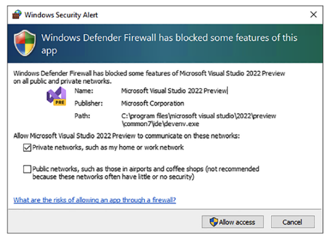

Рисунок 2-8. Запрос брандмауэра Windows

4. Обратите внимание, что вы также можете увидеть второе всплывающее окно брандмауэра. для брокера Xamarin.
5. Выберите свой Mac из списка.
6. Нажмите "Подключить". На рис. 2-9 показано сопряжение с Mac.
диалоговое окно, позволяющее подключить Visual Studio работает в Windows для подключения к ```macOS``` машина.

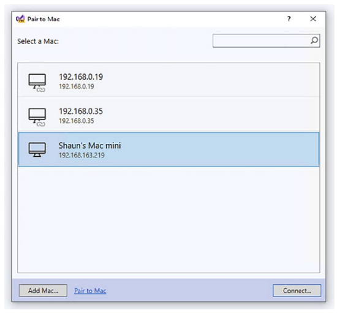

Рисунок 2-9. Сопряжение с экраном Mac

7. Введите имя пользователя и пароль, которые вы используете для войти в свой Mac
8. Дождитесь подключения инструмента и убедитесь, что все настроено на Mac.
9. Когда вы увидите символ, показанный на рис. 2-10, ваша настройка завершена. На рис. 2-10 показана пара к Диалоговое окно Mac с подключенным символом напротив вашего машина макОС.

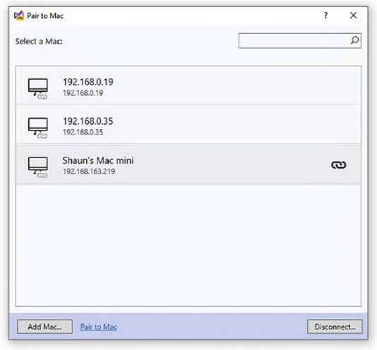

Рисунок 2-10. Экран сопряжения с Mac с подтверждением

10. Visual Studio теперь должна подключаться автоматически
когда вы открываете решение .NET MAUI. Рисунок 2-11 показывает кнопку ```Pair to Mac в Visual Studio``` на Windows.

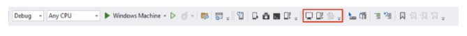

## Устранение неполадок при установке

Учитывая, что в экосистеме разработки есть несколько движущихся частей
при создании приложений .NET MAUI есть куда стремиться. В этом разделе я рассмотрю несколько распространенных проблем и способы их решения. Проверьте, правильно ли все настроено.

## Рабочая нагрузка .NET MAUI отсутствует

Чтобы проверить, установлена ли рабочая нагрузка .NET MAUI, вы
проверить можно либо в ```Visual Studio Installer```, либо через командную строку.

## Установщик Visual Studio

В настоящее время это работает только в Windows, но вы можете выполнить следующие действия.

1. Откройте меню «Пуск».

2. Введите установщик Visual Studio.

3. Откройте программу установки.

4. Выберите «Изменить» в установке Visual Studio 2022.

5. Просмотрите рабочие нагрузки и убедитесь, что мобильный
отмечена разработка с рабочей нагрузкой .NET.

## Командная строка

Преимущество этого заключается в том, что он работает как на Windows, так и на macOS.

1. Откройте сеанс терминала.

2. Выполните следующую команду: список рабочих нагрузок dotnet

3. Убедитесь, что среди результатов есть maui.

```
Установленный идентификатор рабочей нагрузки Версия манифеста Источник установки
-------------------------------------------------- ----
Мауи 7.0.49/7.0.100 SDK 7.0.100
```

## Создание вашего первого приложения

Вы будете использовать пользовательский интерфейс для создания своего приложения, построить и запустить его. Я также включу командную строку ```dotnet``` команды, потому что я считаю, что они могут быть весьма полезны при построении и отладка.

## Создание в Visual Studio

1. Запустите Visual Studio 2022. В окне, которое откроется, выберите опцию "Создать новый проект". Рисунок 2-12 показывает начальный начальный экран в Visual Studio, работающая в Windows с кнопкой "Создать новый вариант" проекта выделен.

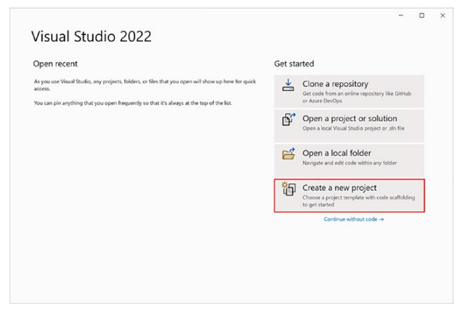

Рисунок 2-12. Создание проекта в Visual Studio

2. В следующем окне введите .NET MAUI в Поле поиска шаблонов. Затем выберите .NET Приложение MAUI и нажмите «Далее». Рисунок 2-13 показывает экран создания проекта с приложением .NET MAUI проект выбран.


Рисунок 2-13. Выбор типа проекта приложения .NET MAUI

3. В следующем окне введите имя вашего проекта. Я выбрал виджетборд. Выберите место, если хотите хотел бы сохранить его в другом месте, отличном от значения по умолчанию местоположение и нажмите «Создать». Рисунок 2-14 показывает Настройте экран нового проекта в Visual Studio.

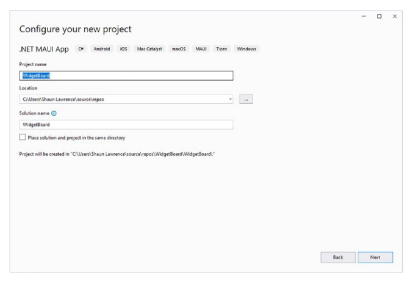

Рисунок 2-14. Диалоговое окно «Настройка нового проекта»

**Замечание:** Имейте в виду, что в Windows есть ограничение на длину путь расположения. Если путь длиннее 255 символов, то последует странное поведение. Visual Studio не сможет выполнить идеальную сборку действительный код и так далее. Это можно исправить, отключив ограничение пути

(https://learn.microsoft.com/windows/win32/fileio/maximum-file-path-limitation?tabs=cmd#enable-longpaths-in-windows-10-version-1607-and-later).

4. Выберите версию .NET, которую вы хотите использовать. В то время написания этой книги .NET 7.0 является текущей версией поэтому я использую эту версию. Рисунок 2-15 показывает Диалог дополнительной информации, где вы можете выбрать версия .NET Framework для вашего приложения.

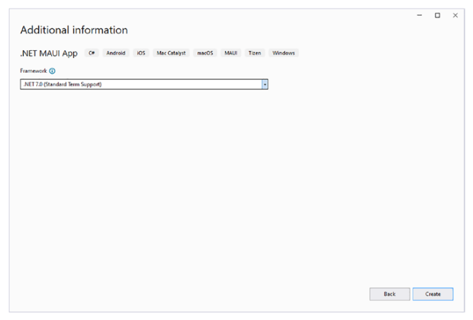

Рисунок 2-15. Диалог выбора .NET Framework

5. Дождитесь создания проекта и любого фона задачи восстановления и сборки, которые необходимо выполнить.

А теперь полюбуйтесь самым первым приложением .NET MAUI, которое мы создали.

## Создание в командной строке

Хотя командная строка может показаться более сложной, иногда на самом деле требуется меньше шагов, чем при использовании Visual Studio.

1. Откройте сеанс терминала/командной строки.
2. Перейдите в место, где вы хотите создать свой приложение:

```cd c:\work\```

3. Создайте приложение, дав проекту имя:
```dotnet new maui --name WidgetBoard```

4. Перейдите в новую папку WidgetBoard:
```cd WidgetBoard```

5. Подтяните все зависимости для приложения:
```dotnet restore```

Теперь у вас есть приложение .NET MAUI. Приступим к изучению того, как
построить и в конечном итоге запустить его.

## Создание и запуск вашего первого приложения

Теперь, когда вы создали свой проект, давайте продолжим сборку и запуск.
это для того, чтобы ознакомиться с инструментами. Представление сингла
проектный подход к приложениям ```.NET MAUI``` может изменить ваш путь
думать, когда дело доходит до создания приложений. В прошлом решение
содержащие проекты .NET, как правило, имеют один стартовый проект,
но эти проекты будут иметь один выход. Теперь, когда один проект
на самом деле имеет несколько выходов, вам нужно научиться настраивать это для
ваши сборки. На самом деле это делается нажатием на стрелку вниз, которую можно показано на рисунке 2-16.

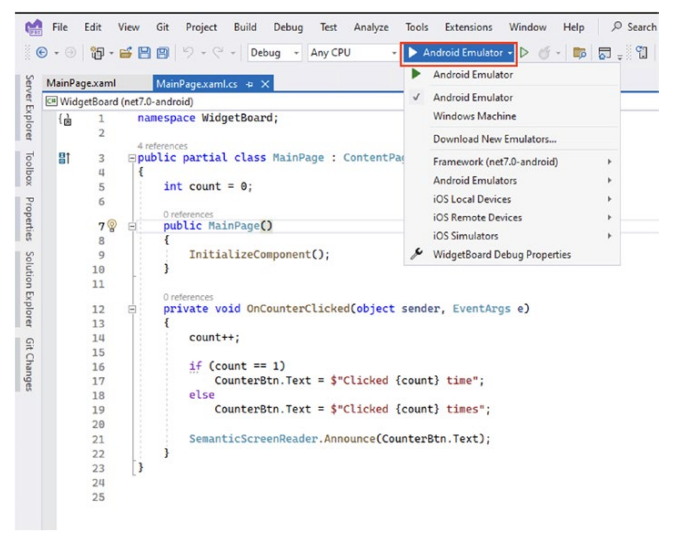

Рисунок 2-16. Построить раскрывающийся список выбора цели в Visual Studio

Вы также можете заметить выпадающий список в WidgetBoard (net7.0-android). Это позволяет показывать в файл, который относится к этой конкретной цели, но это не влияет на то, что в данный момент компилируется. На рис. 2-17 это показано немного яснее.
1. Здесь вы устанавливаете текущую цель для компиляции
и запуска.
2. Это выделение в файле кода того, что будет компилироваться
для цели, выбранной в раскрывающемся списке. Обратите внимание здесь
который вы компилируете для Windows, но показываете что бы скомпилировать для Android.

На рис. 2-17 выделены элементы 1 и 2 из приведенного выше списка.
что скомпилировано, а что предназначено в Visual Studio.

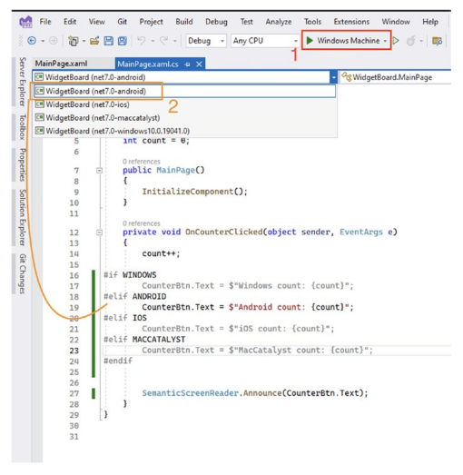

Рисунок 2-17. Отображение различий между тем, какая цель является
скомпилировано и какая цель отображается в текущем редакторе

## Знакомство с вашим приложением

Вместе мы будем создавать приложение с самых начальных этапов
вплоть до развертывания его в магазинах для общественного потребления. Учитывая, что приложение будет играть такую ключевую роль в этой книге, я хочу представить вы к концепции в первую очередь.
Я хочу попробовать что-то немного отличающееся от обычных типов приложения, созданные как часть книги или курса. Что-то, что требует изрядное количество функций, которые также необходимы многим реальным приложениям.
Что-то, что может помочь использовать потенциально старое оборудование, поэтому мы может дать им новую жизнь.

## WhiteBoard

Приложение, которое мы будем создавать вместе, позволит пользователям превратить старые планшеты или компьютеры в свою уникальную цифровую доску. Рисунок 2-18 показывает набросок того, как это может выглядеть после того, как пользователь настроит его.

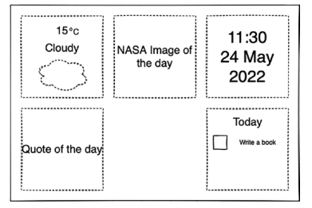

Рисунок 2-18. Эскизный прототип приложения, которое мы будем создавать

Мы создадим «виджеты», которые можно расположить на экране. Эти виджеты будут варьироваться от показа текущего времени до вытягивания погоды
информацию из веб-API для отображения изображений из вашей библиотеки. 
Пользователь также сможет настроить цвет, среди других опций, и
в конечном итоге сохраните эти изменения, чтобы они были запомнены, когда
затем пользователь открывает приложение.
Я планирую предоставить цифровой календарь/фоторамку для нашего
```Home```. Я хотел бы услышать или увидеть, что вы можете построить.

# Краткое содержание

В этой главе у вас есть

• Настройте среду разработки так, чтобы вы были способны создавать, строить и, в конечном счете, запускать/развертывать приложения.
• Создание, построение и запуск своего самого первого .NET MAUI приложения
• Познакомились с приложением, которое будем создавать вместе

В следующей главе вы будете:

• Разберите только что созданное приложение.
• Получить представление о ключевых компонентах приложения .NET MAUI.
• Узнайте о жизненном цикле приложения .NET MAUI.

# Исходный код

Полученный исходный код для этой главы можно найти на GitHub.
репозиторий на https://github.com/Apress/Introducing-MAUI/tree/main/ch02.
